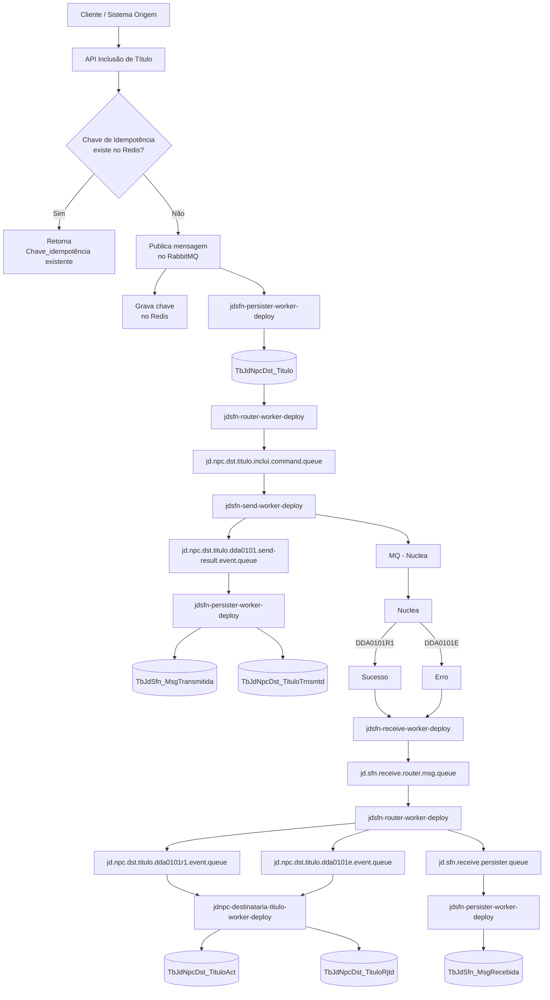

# 📡 Fluxo de Chamada da API – Inclusão de Título

---

## 🧾 Metadados do Documento

| Campo | Valor |
|-----|------|
| Sistema | NPC |
| Domínio | JD CONSULTORES |
| Responsável | LUCAS |
| Time | JD IMPLANTAÇÃO |
| Versão | 1.0 |
| Status | Aprovado |
| Última atualização | 20-01-2026 |

---

## 🎯 Objetivo

Descrever de forma clara e rastreável a arquitetura, responsabilidades e fluxos do sistema ou funcionalidade documentada.

---

## 🧠 Contexto

> **Contexto:**  
> Este documento descreve o fluxo completo de inclusão de título, desde a chamada da API até o retorno da Nuclea,
> incluindo idempotência, mensageria e persistência.

---

## 🔁 Visão Geral do Fluxo



---

## 1️⃣ Chamada Inicial da API

- **Endpoint**
```http
POST destinataria-titulo-api/jdnpc/destinatario/api/v1/titulo
```

- Serviço responsável:
  - `jdnpc-destinataria-titulo-api-deploy`

---

## 2️⃣ Verificação de Idempotência (Redis)

- Consulta ao Redis para validação da **Chave de Idempotência**
- Serviço:
  - `jdnpc-destinataria-titulo-api-deploy`

### Decisão
- ✅ Chave existente → retorna resposta anterior  
- ❌ Chave inexistente → continua o processamento

---

## 3️⃣ Processamento Inicial

### 📤 Publicação
- Envia mensagem para o **RabbitMQ**
- Grava chave no Redis

### 💾 Persistência Inicial
- Serviço:
  - `jdsfn-persister-worker-deploy`
- Tabela:
```sql
TbJdNpcDst_Titulo
```

---

## 4️⃣ Roteamento e Envio

### 🔀 Roteamento
- Serviço:
  - `jdsfn-router-worker-deploy`
- Fila:
```text
jd.npc.dst.titulo.inclui.command.queue
```

### 📡 Envio para MQ
- Serviço:
  - `jdsfn-send-worker-deploy`
- Fila:
```text
jd.npc.dst.titulo.dda0101.send-result.event.queue
```

### 🗃️ Persistência
- Serviço:
  - `jdsfn-persister-worker-deploy`
- Tabelas:
```sql
TbJdSfn_MsgTransmitida
TbJdNpcDst_TituloTrnsmtd
```

---

## 5️⃣ Processamento pela Nuclea

| Código | Resultado |
|------|----------|
| DDA0101R1 | Sucesso |
| DDA0101E | Erro |

---

## 6️⃣ Recebimento da Resposta

- Serviço:
  - `jdsfn-receive-worker-deploy`
- Fila:
```text
jd.sfn.receive.router.msg.queue
```

### Roteamento do Retorno
- Serviço:
  - `jdsfn-router-worker-deploy`
- Filas:
```text
jd.npc.dst.titulo.dda0101r1.event.queue
jd.npc.dst.titulo.dda0101e.event.queue
jd.sfn.receive.persister.queue
```

---

## 7️⃣ Persistência Final

### Mensagens Recebidas
- Serviço:
  - `jdsfn-persister-worker-deploy`
- Tabela:
```sql
TbJdSfn_MsgRecebida
```

### Status do Título

| Situação | Tabela |
|--------|--------|
| Sucesso | TbJdNpcDst_TituloAct |
| Erro | TbJdNpcDst_TituloRjtd |

---

## ✅ Conclusão

- Controle de idempotência via Redis  
- Mensageria desacoplada  
- Persistência em todas as etapas críticas  
- Tratamento completo de sucesso e erro
