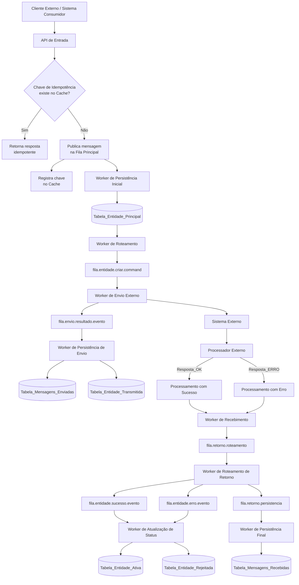

# 📡 Fluxo de Chamada da API – Inclusão de Título

---

## 🧾 Metadados do Documento

| Campo | Valor |
|-----|------|
| Sistema | NPC |
| Domínio | JD CONSULTORES |
| Responsável | LUCAS |
| Time | JD IMPLANTAÇÃO |
| Versão | 1.0 |
| Status | Aprovado |
| Última atualização | 20-01-2026 |

---

## 🎯 Objetivo

Descrever de forma clara e rastreável a arquitetura, responsabilidades e fluxos do sistema ou funcionalidade documentada.

---

## 🧠 Contexto

> **Contexto:**  
> Este documento descreve o fluxo completo de inclusão de título, desde a chamada da API até o retorno da Nuclea,
> incluindo idempotência, mensageria e persistência.

---

## 🔁 Visão Geral do Fluxo



---

## 1️⃣ Chamada Inicial da API

- **Endpoint**
```http
POST api-entidade/v1/entidades
```

- Serviço responsável:
  - `api-entidade-gateway`

---

## 2️⃣ Verificação de Idempotência (Cache)

- Consulta ao **Cache Distribuído** para validação da **Chave de Idempotência**
- Serviço:
  - `api-entidade-gateway`

### Decisão
- ✅ Chave existente → retorna resposta previamente processada  
- ❌ Chave inexistente → continua o fluxo de processamento

---

## 3️⃣ Processamento Inicial

### 📤 Publicação
- Publica mensagem na **Fila de Entrada**
- Registra a chave de idempotência no **Cache Distribuído**

### 💾 Persistência Inicial
- Serviço:
  - `worker-persistencia-inicial`
- Tabela:
```sql
TBL_ENTIDADE_BASE
```

---

## 4️⃣ Roteamento e Envio

### 🔀 Roteamento
- Serviço:
  - `worker-roteamento-comando`
- Fila:
```text
fila.entidade.criar.command
```

### 📡 Envio para Sistema Externo
- Serviço:
  - `worker-envio-externo`
- Fila:
```text
fila.entidade.envio.resultado.event
```

### 🗃️ Persistência de Envio
- Serviço:
  - `worker-persistencia-envio`
- Tabelas:
```sql
TBL_MENSAGENS_ENVIADAS
TBL_ENTIDADE_ENVIADA
```

---

## 5️⃣ Processamento pelo Sistema Externo

| Código | Resultado |
|------|----------|
| RESP_OK | Processamento realizado com sucesso |
| RESP_ERRO | Falha no processamento |

---

## 6️⃣ Recebimento da Resposta

- Serviço:
  - `worker-recebimento-retorno`
- Fila:
```text
fila.retorno.roteamento
```

### Roteamento do Retorno
- Serviço:
  - `worker-roteamento-retorno`
- Filas:
```text
fila.entidade.sucesso.event
fila.entidade.erro.event
fila.retorno.persistencia
```

---

## 7️⃣ Persistência Final

### Mensagens Recebidas
- Serviço:
  - `worker-persistencia-final`
- Tabela:
```sql
TBL_MENSAGENS_RECEBIDAS
```

### Status da Entidade

| Situação | Tabela |
|--------|--------|
| Sucesso | TBL_ENTIDADE_ATIVA |
| Erro | TBL_ENTIDADE_REJEITADA |

---

## ✅ Conclusão

- Controle de idempotência via **Cache Distribuído**  
- Arquitetura orientada a **mensageria assíncrona**  
- Persistência aplicada em todos os pontos críticos  
- Tratamento explícito de sucesso e erro  

---

> Documento genérico para uso público, estudos arquiteturais e portfólio técnico.
