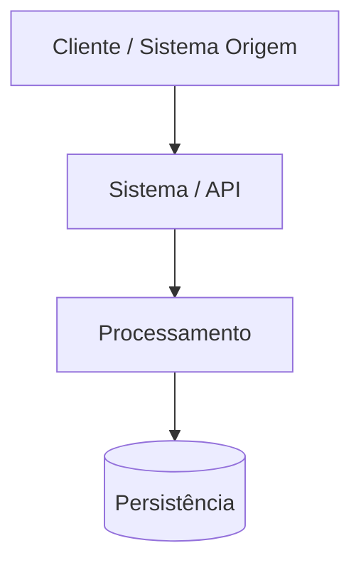

# 📐 Template Oficial de Documento de Arquitetura

> **Propósito**  
> Este template define o padrão oficial para documentação de arquitetura técnica no JD Group.
> Deve ser utilizado para APIs, fluxos assíncronos, mensageria e integrações.

---

## 🧾 Metadados do Documento

| Campo | Valor |
|-----|------|
| Sistema | |
| Domínio | |
| Responsável | |
| Time | |
| Versão | 1.0 |
| Status | Draft / Aprovado |
| Última atualização | |
| Referência | ADR-XXX (se aplicável) |

---

## 🎯 Objetivo

Descrever de forma clara e rastreável a arquitetura, responsabilidades e fluxos do sistema ou funcionalidade documentada.

---

## 🧠 Contexto

Explique o **problema de negócio** ou **necessidade técnica** que motivou esta arquitetura.

---

## 🏗️ Visão Geral da Arquitetura

<!-- omit from toc -->

---

## 🧩 Componentes Envolvidos

### Aplicações / Serviços
- Nome do serviço
- Responsabilidade

### Infraestrutura
- Banco de dados
- Cache
- Mensageria
- Integrações externas

---

## 🔁 Fluxo Funcional (Passo a Passo)

### 1️⃣ Entrada
Descrever a entrada do fluxo (API, evento, batch, etc.)

### 2️⃣ Processamento
Descrever regras, decisões e validações

### 3️⃣ Saída
Descrever resultados, eventos e estados finais

---

## 🧵 Mensageria (se aplicável)

| Fila / Tópico | Produtor | Consumidor | Finalidade |
|--------------|---------|-----------|------------|

---

## 💾 Persistência

| Tabela | Responsabilidade |
|------|-----------------|

---

## ⚠️ Tratamento de Erros

- Erros funcionais
- Erros técnicos
- Retentativas
- Dead Letter Queue (DLQ)

---

## 🔐 Segurança

- Autenticação
- Autorização
- Idempotência
- Criptografia (se aplicável)

---

## 📊 Observabilidade

- Logs
- Métricas
- Tracing
- Alertas

---

## 🧪 Testes

- Testes unitários
- Testes de integração
- Cenários críticos

---

## 🧭 Riscos e Considerações

- Pontos de atenção
- Trade-offs
- Limitações conhecidas

---

## 🔗 Referências

- Links
- ADRs
- Documentos relacionados

---

## ✅ Conclusão

Resumo arquitetural e próximos passos.
